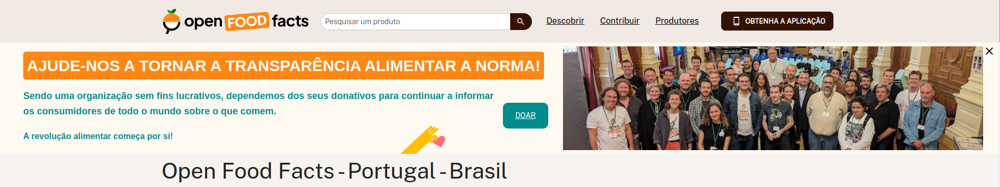
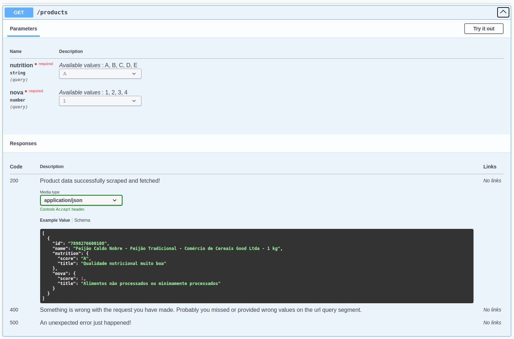

<div align="center">
  <br />
    <a href="https://br.openfoodfacts.org/" target="_blank">
      
    </a>
  <br />

[//]: # (  <div>)

[//]: # (    )

[//]: # (  </div>)

  <h3 align="center">Web Scraper API</h3>

   <div align="center">
     This project was build is response to the <a href="https://devnology.com.br/">Devnology</a> Junior Developer position job application. A first challenge in the selection process.
    </div>
</div>

## 📋 <a name="table">Table of Contents</a>

1. 🤖 [Introduction](#introduction)
2. ⚙️ [Tech Stack](#tech-stack)
3. 🔋 [Features](#features)
4. 🤸 [Quick Start](#quick-start)
5. 🕸️ [Snippets](#snippets)
6. 🕸️ [Challenges](#challenges)

## <a name="introduction">🤖 Introduction</a>
This repository contains the source code of an API developed for web scraping on the Open Food Facts website. This API was created as part of the Junior Developer position selection process at <a href="https://devnology.com.br/">Devnology</a>.

## <a name="tech-stack">⚙️ Tech Stack</a>

- NestJs
- TypeScript
- Puppeteer

## <a name="features">🔋 Features</a>

👉 **Fetch Products**: The API allows the retrieval of products based on specific criteria, such as Nutri-Score and NOVA.

👉 **Product Details**: Provides comprehensive details of a specific product, fetched by id, including nutritional information, ingredients, Nutri-Score classification, etc.


## <a name="quick-start">🤸 Quick Start</a>

Follow these steps to set up the project locally on your machine.

**Prerequisites**

Make sure you have the following installed on your machine:

- [Git](https://git-scm.com/)
- [Node.js](https://nodejs.org/en)
- [npm](https://www.npmjs.com/) (Node Package Manager)
- [NestJs CLI](https://docs.nestjs.com/)

**Cloning the Repository**

```bash
git clone https://github.com/Steravy/web-crawler.git
cd web-crawler
```

**Installation**

Install the project dependencies using npm:

```bash
npm install
```

**Running the Project**

```bash
npm run dev
```

**Getting familiar with the api**


In your browser, visit http://localhost:5000/api to open the <a href="https://docs.nestjs.com/openapi/introduction">Swagger UI</a>. The api full documentation.


<a href=" http://localhost:5000/api" target="_blank">

</a>


**Scraping Data**

Open an API testing tool like <a>Postman</a>, <a>JetClient</a> or the good old ```CURL```. I will demonstrate using ```CURL``` in the following code snippets.


## <a name="snippets">🕸️ Code Snippets</a>

<details>
<summary><code>Fetch Products</code></summary>

curl -H "Accept: application/json" 'http://localhost:5000/products?nutrition=A&nova=1' | jq

```typescript

[
  {
    "id": "3155250349793",
    "name": "Creme Chantilly Président - 250 g (241 ml)",
    "nutrition": {
      "score": "D",
      "title": "Qualidade nutricional baixa"
    },
    "nova": {
      "score": "4",
      "title": "Alimentos ultra-processados"
    }
  },
  {
    "id": "3046920010603",
    "name": "Chocolate meio amargo com framboesa - Lindt - 100 g e",
    "nutrition": {
      "score": "E",
      "title": "Má qualidade nutricional"
    },
    "nova": {
      "score": "4",
      "title": "Alimentos ultra-processados"
    }
  },
]

```

</details>

<details>
<summary><code>Product Details</code></summary>

curl -H "Accept: application/json" 'http://localhost:5000/products/3155250349793' | jq

```typescript

{
  "title": "Futuro Burger - Fazenda Futuro - 230 g",
  "quantity": "230 g",
  "ingredients": {
  "hasPalmOil": "unknown",
    "isVegan": false,
    "isVegetarian": false,
    "list": [
    "Água, preparado proteico (proteína texturizada de soja, proteína isolada de soja e proteína de ervilha), gordura de coco, óleo de canola, aroma natural, estabilizante metilcelulose, sal, beterraba em pó e corante carvão vegetal."
  ]
},
  "nutrition": {
  "score": "D",
    "values": [
    [
      "moderate",
      "Gorduras/lípidos em quantidade moderada (11.9%)"
    ],
    [
      "high",
      "Gorduras/lípidos/ácidos gordos saturados em quantidade elevada (8%)"
    ],
    [
      "low",
      "Açúcares em quantidade baixa (0%)"
    ]
  ],
    "servingSize": "80 g",
    "data": {
    "Energia": {
      "per100g": "814 kj(194 kcal)",
        "perServing": "651 kj(155 kcal)"
    },
    "Gorduras/lípidos": {
      "per100g": "11,9 g",
        "perServing": "9,5 g"
    },
    "Carboidratos": {
      "per100g": "7,88 g",
        "perServing": "6,3 g"
    },
    "Fibra alimentar": {
      "per100g": "?",
        "perServing": "?"
    },
    "Proteínas": {
      "per100g": "13,8 g",
        "perServing": "11 g"
    },
    "Sal": {
      "per100g": "0,565 g",
        "perServing": "0,452 g"
    }
  }
},
  "nova": {
  "score": 4,
    "title": "Alimentos ultra-processados"
}
}
```

</details>


## <a name="challenges">🕸️ Challenges</a>
The first challenge i have met was the factor time, because i get the challenge very close to the deadline, but i knew i could do it, an here it is.
Another challenge faced was the fact that the Open Food Facts website is not a static website, so i had to use a headless browser to scrape the data and. I used Puppeteer to do this, and it worked very well.
The pattern of the elements varies from product to product, so i had to create a set of rules to scrape the data from the website. Finding a pattern that would do the job took some time. I believe there is still a lot of work to do, but the deadline have to be respected.
Scrapping the data from the website was the most challenging part of the project, but i have learned a lot from it. I now know the meaning of the data mining term. Open Food Facts is a very rich website, but the structure and all the indentation layer makes it a little bit hard to scrape the data.

## Author
[Stefan Vitoria](https://github.com/Steravy)
